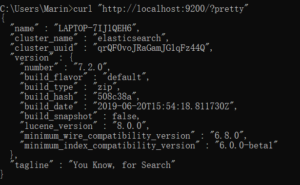
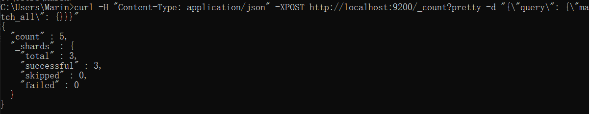
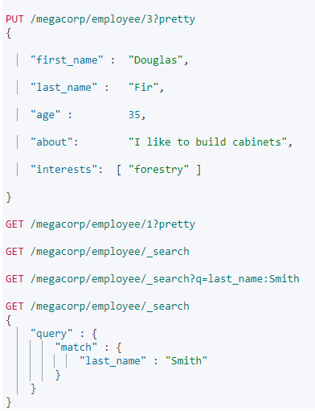
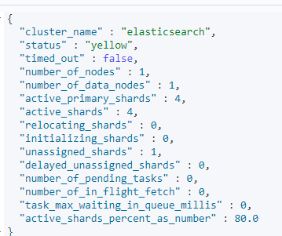

[TOC]
### 安装es
官网下载即可  
window双击elasticsearch.bat 
验证是否开启：浏览器访问 http://localhost:9200/?pretty 出现以下内容   
````vega-lite
{
  "name" : "LAPTOP-7IJ1QEH6",
  "cluster_name" : "elasticsearch",
  "cluster_uuid" : "qrQF0voJRaGamJG1qFz44Q",
  "version" : {
    "number" : "7.2.0",
    "build_flavor" : "default",
    "build_type" : "zip",
    "build_hash" : "508c38a",
    "build_date" : "2019-06-20T15:54:18.811730Z",
    "build_snapshot" : false,
    "lucene_version" : "8.0.0",
    "minimum_wire_compatibility_version" : "6.8.0",
    "minimum_index_compatibility_version" : "6.0.0-beta1"
  },
  "tagline" : "You Know, for Search"
}
````
kibana 也是官网下载  
window双击kibana.bat
启动时会自动链接本机的es
验证是否开启：浏览器访问 http://localhost:5601/  

*es和kibana版本要一致*



### 交互
#### 内置两个客户端
1. 节点客户端：节点客户端作为一个非数据节点加入到本地集群中。它本身不保存任何数据，但是它知道数据在集群中的哪个节点中，并且可以把请求转发到正确的节点。
2. 传输客户端：轻量级的传输客户端可以将请求发送到远程集群。它本身不加入集群，但是它可以将请求转发到集群中的一个节点上。

```linux
curl -X<VERB> '<PROTOCOL>://<HOST>:<PORT>/<PATH>?<QUERY_STRING>' -d '<BODY>'
```
|关键字    |值    |
|-----------  |  -----:|
| VERB |  适当的 HTTP 方法 或 谓词 : GET、 POST、 PUT、 HEAD 或者 DELETE。
|PROTOCOL|http 或者 https（如果你在 Elasticsearch 前面有一个 https 代理）|
|HOST|Elasticsearch 集群中任意节点的主机名，或者用 localhost 代表本地机器上的节点。|
|PORT|运行 Elasticsearch HTTP 服务的端口号，默认是 9200 。|
|PATH|API 的终端路径（例如 _count 将返回集群中文档数量）。Path 可能包含多个组件，例如：_cluster/stats 和 _nodes/stats/jvm 。|
|QUERY_STRING|任意可选的查询字符串参数 (例如 ?pretty 将格式化地输出 JSON 返回值，使其更容易阅读)|
|BODY|一个 JSON 格式的请求体 (如果请求需要的话)|

示例：计算及其中文档的数量  
  
 
````linux
curl -H "Content-Type: application/json" -i -XPOST http://localhost:9200/_count?pretty -d "{\"query\": {\"match_all\": {}}}"
``````
-i : 显示头部信息      
<br/>

### 面向文档
Elasticsearch 是 面向文档 的，意味着它存储整个对象或 文档。Elasticsearch 不仅存储文档，而且 索引 每个文档的内容，使之可以被检索。在 Elasticsearch 中，我们对文档进行索引、检索、排序和过滤—​而不是对行列数据。这是一种完全不同的思考数据的方  式，也是 Elasticsearch 能支持复杂全文检索的原因。  

### 索引
存储数据到 Elasticsearch 的行为叫做 索引   

简单的put和get  
  

稍复杂的get(last_name包含smith且age大于30岁的)  
  


### 分布式特性
#### es自动操作
- 分配文档到不同的容器 或 分片 中，文档可以储存在一个或多个节点中
- 按集群节点来均衡分配这些分片，从而对索引和搜索过程进行负载均衡
- 复制每个分片以支持数据冗余，从而防止硬件故障导致的数据丢失
- 将集群中任一节点的请求路由到存有相关数据的节点
- 集群扩容时无缝整合新节点，重新分配分片以便从离群节点恢复  


  
## 集群原理
### 集群健康
GET /_cluster/health  
  
status 字段
- green：所有的朱分片和福分片都正常运行
- yellow：所有的主分片都正常运行，但不是所有的福分片都正常运行
- red：有主分片没能正常运行
   
