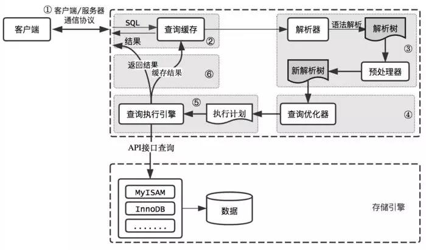
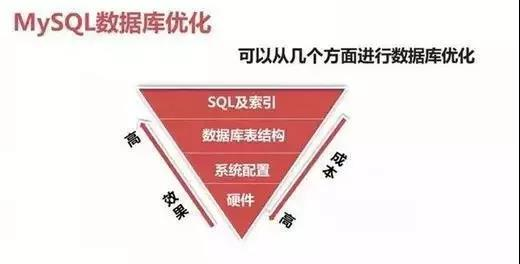
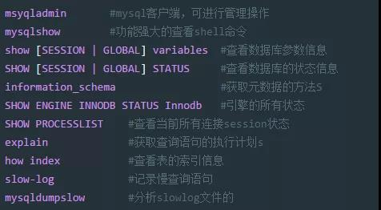
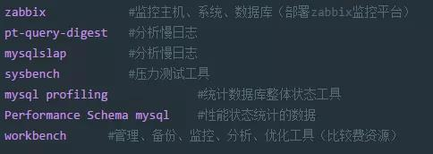
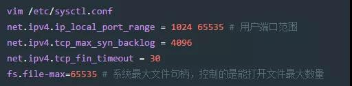
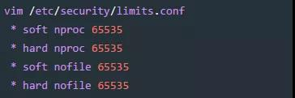
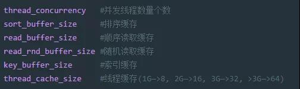
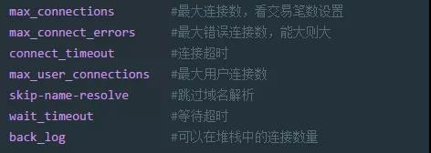
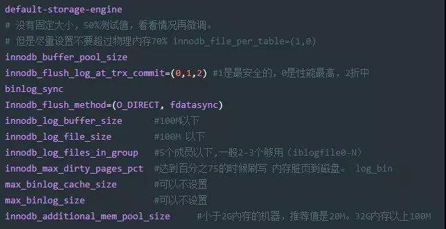

[TOC]
----

#### SQL执行流程

----
#### 优化的风险
##### 可能带来的问题
- 优化不总是对一个单纯的环境进行，还很可能是一个复杂的已投产的系统。
- 优化手段本来就有很大的风险，只不过你没能力意识到和预见到！
- 任何的技术可以解决一个问题，但必然存在带来一个问题的风险！
- 对于优化来说解决问题而带来的问题,控制在可接受的范围内才是有成果。
- 保持现状或出现更差的情况都是失败！

##### 优化的需求
- 稳定性和业务可持续性,通常比性能更重要！
- 优化不可避免涉及到变更，变更就有风险！
- 优化使性能变好，维持和变差是等概率事件！
- 切记优化,应该是各部门协同，共同参与的工作，任何单一部门都不能对数据库进行优化！
- 所以优化工作,是由业务需要驱使的！！！

##### 优化由谁参与
在进行数据库优化时，应由数据库管理员、业务部门代表、应用程序架构师、应用程序设计人员、应用程序开发人员、硬件及系统管理员、存储管理员等，业务相关人员共同参与。

#### 优化思路
##### 优化什么
主要两点，即安全与性能
- 安全-->数据可持续性
- 性能-->数据的高性能访问

##### 优化范围
**存储、主机和操作系统方面**：
- 主机架构稳定性
- I/O规划及配置
- Swap交换区
- OS内核参数和网络问题
**应用程序方面**：
- 应用程序稳定性
- SQL语句性能
- 串行访问资源
- 性能欠佳会话管理
- 这个应用适不适合用MySQL
**数据库优化方面**：
- 内存
- 数据库结构（物理&逻辑）
- 实例配置

##### 优化维度
四个维度：硬件、系统配置、数据库表结构、SQL及索引

优化选择：
- 优化成本：硬件 > 系统配置 > 数据库表结构 > SQL及索引
- 优化效果：硬件 < 系统配置 < 数据库表结构 < SQL及索引

#### 优化工具
##### 数据库层面
检查问题常用工具

不常用但好用的工具

##### 数据库层面问题解决思路
**应急思路**：
针对突然的业务办理卡顿，无法进行正常的业务处理，需要立马解决的场景
1. show processlist
2. explain select ......
    show index from table; 
3. 通过执行计划判断，索引问题或者语句本身问题
4. show status like '%lock%';  //查询锁状态
    kill SESSION_ID;     //杀掉有问题的session

**常规调优思路**：
针对业务周期性的卡顿，例如在每天10-11点业务特别慢，但是还能够使用，过了这段时间就好了。
1. 查看slowlog，分析slowlog，分析出查询慢的语句。
2. 按照一定优先级，进行一个一个的排查所有慢语句。
3. 分析top sql，进行explain调试，查看语句执行时间。
4. 调整索引或语句本身。

##### 系统层面
**CPU**：vmstat、sar top、htop、nmon、mpstat
*vmstat 命令说明*：
- Procs：r显示有多少进程正在等待CPU时间。b显示处于不可中断的休眠的进程数量。在等待I/O
- Memory：swpd显示被交换到磁盘的数据块的数量。未被使用的数据块，用户缓冲数据块，用于操作系统的数据块的数量
- Swap：操作系统每秒从磁盘上交换到内存和从内存交换到磁盘的数据块的数量。s1和s0最好是0
- Io：每秒从设备中读入b1的写入到设备b0的数据块的数量。反映了磁盘I/O
- System：显示了每秒发生中断的数量(in)和上下文交换(cs)的数量
- Cpu：显示用于运行用户代码，系统代码，空闲，等待I/O的CPU时间

*iostat命令说明*
实例命令： iostat -dk 1 5(查看设备使用率和响应时间)
- tps：该设备每秒的传输次数。“一次传输”意思是“一次I/O请求”。多个逻辑请求可能会被合并为“一次I/O请求”。
- iops ：硬件出厂的时候，厂家定义的一个每秒最大的IO次数,"一次传输"请求的大小是未知的。
- kB_read/s：每秒从设备（drive expressed）读取的数据量；
- KB_wrtn/s：每秒向设备（drive expressed）写入的数据量；
- kB_read：读取的总数据量；
- kB_wrtn：写入的总数量数据量；这些单位都为Kilobytes。

**内存**：free、ps-aux
**IO设备**：iostat、ss、netstat、iptraf、iftop、lsof

#### 系统层面问题解决
在实际的生产中，一般认为CPU只要不超过90%都没什么问题
还有一些特殊情况：
##### 问题一：cpu负载高，IO负载低
- 内存不够
- 磁盘性能差
- SQL问题
- IO出问题了（磁盘到临界了、raid设计不好、raid降级、锁、tps过高）
- tps过高：大量的小数据IO、大量的全表扫描
##### 问题二：IO负载高，cpu负载低
- 大量小的IO 写操作：
- autocommit ，产生大量小IO
- IO/PS,磁盘的一个定值，硬件出厂的时候，厂家定义的一个每秒最大的IO次数。
- 大量大的IO 写操作
- SQL问题的几率比较大
##### 问题三：IO和cpu负载都很高
硬件不够了，或SQL存在问题

#### 基础优化
##### 优化思路
**问题定位**：硬件-->系统-->应用-->数据库-->架构（高可用、读写分离、分库分表）
**处理方向**：明确优化目标，性能和安全的折中，防患未然
##### 硬件优化
**主机方面** ：
- 根据数据库类型，主机CPU选择、内存容量选择、磁盘选择
- 平衡内存和磁盘资源
- 随机的I/O和顺序的I/O
- 主机 RAID卡的BBU(Battery Backup Unit)关闭
**cpu的选择**：
cpu的两个关键因素：核数、主频
根据不同的业务类型进行选择：
- cpu密集型：计算比较多，OLTP 主频很高的cpu、核数还要多
- IO密集型：查询比较，OLAP 核数要多，主频不一定高的
**内存的选择**：
- OLAP类型数据库，需要更多内存，和数据获取量级有关。
- OLTP类型数据一般内存是cpu核心数量的2倍到4倍，没有最佳实践。
**存储方面**：
- 根据存储数据种类的不同，选择不同的存储设备
- 配置合理的RAID级别(raid5、raid10、热备盘)
- 对与操作系统来讲，不需要太特殊的选择，最好做好冗余（raid1）（ssd、sas 、sata）
**raid卡：主机raid卡选择**：
- 实现操作系统磁盘的冗余（raid1）
- 平衡内存和磁盘资源
- 随机的I/O和顺序的I/O
- 主机 RAID卡的BBU(Battery Backup Unit)要关闭。
**网络设备方面**：
使用流量支持更高的网络设备（交换机、路由器、网线、网卡、HBA卡）
注意：以上这些规划应该在初始设计系统时就应该考虑好。

##### 服务器硬件优化
1. 物理状态灯
2. 自带管理设备：远程控制卡（FENCE设备：ipmi ilo idarc），开关机、硬件监控。
3. 第三方的监控软件、设备（snmp、agent）对物理设施进行监控
4. 存储设备：自带的监控平台。EMC2（hp收购了）， 日立（hds），IBM低端OEM hds，高端存储是自己技术，华为存储

##### 系统优化
**CPU**：在硬件方面下功夫
**内存**：在硬件方面下功夫
**swap**：MySQL尽量避免使用swap。
**IO**：
- raid、no lvm、 ext4或xfs、ssd、IO调度策略
- Swap调整(不使用swap分区)

##### 系统参数调整
Linux系统内核参数优化：

用户限制参数（MySQL可以不配置一下配置）

#### 数据库优化
**SQL优化方向**：执行计划、索引、SQL改写
**架构优化方向**：高可用架构、高性能架构、分库分表
##### 数据库参数优化:
**实例整体**

**连接层**：设置合理的连接客户和连接方式

**SQL层**：
- query_cache_size： 查询缓存
- OLAP类型数据库,需要重点加大此内存缓存.
- 但是一般不会超过GB.
- 对于经常被修改的数据，缓存会立马失效。
- 我们可以实用内存数据库（redis、memecache），替代他的功能。

##### 存储引擎层（Innodb基础优化参数）

