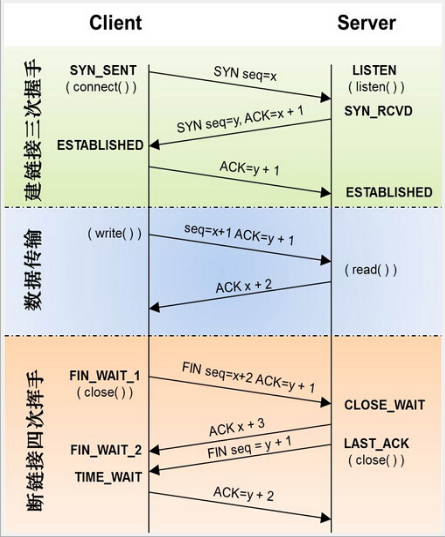

#### 在浏览器输入URL后发生的事
1. 解析URL，抽取出域名字段
2. DNS解析
- **查询浏览器缓存**（浏览器会缓存之前拿到的DNS 2-30分钟）如果没有 
- **检查系统缓存**， 检查hosts文件，这个文件保存了一些以前访问过的网站的域名和IP的数据
- **检查路由器缓存** ，路由器有自己的DNS缓存（**本地服务器缓存**）那里可能有相关的内容
- **递归查询**，从根域名服务器到顶级域名服务器再到极限域名服务器依次搜索对应的目标域名的IP
3. 找到对应的ip后就建立TCP连接（三次握手）
 

 4. 请求和传输数据
 5. 页面渲染
 **总结**：DNS->CDN->负载均衡->反向代理->http（get、post）->TCP四层数据流转（握手、关闭）->Servlet->MVC->缓存->持久化->页面渲染

---
 #### OSI七层模型
 **应用层**：OSI参考模型的最高层，它是计算机用户以及各种应用程序和网络之间的接口
 - 功能：直接向用户提供服务，完成用户希望在网络上完成的各种工作。它在其他6层工作的基础上，负责完成网络中应用程序与网络操作系统之间的联系，建立与结束使用者之间的联系，并完成网络用户提出的各种网络服务及应用所需的监督、管理和服务等各种协议。此外，该层还负责协调各个应用程序间的工作
 **表示层**：对来自应用层的命令和数据进行解释，对各种语法赋予相应的含义，并按照一定的格式传送给会话层。
 - 功能：处理用户信息的表示问题，如编码、数据格式转换和加密解密
 表示层的具体功能如下：
　　　　数据格式处理：协商和建立数据交换的格式，解决各应用程序之间在数据格式表示上的差异。
　　　　数据的编码：处理字符集和数字的转换。例如由于用户程序中的数据类型（整型或实型、有符号或无符号等）、用户标识等都可以有不同的表示方式，因此，在设备之间需要具有在不同字符集或格式之间转换的功能。
　　　　压缩和解压缩：为了减少数据的传输量，这一层还负责数据的压缩与恢复。
　　　　数据的加密和解密：可以提高网络的安全性。
 **会话层**：用户应用程序和网络之间的接口
 - 功能：向两个实体的表示层提供建立和使用连接的方法。将不同实体之间的表示层的连接称为会话。因此会话层的任务就是组织和协调两个会话进程之间的通信，并对数据交换进行管理。
 **传输层**：通信子网和资源子网的接口和桥梁，起到承上启下的作用
 - 任务：向用户提供可靠的、端到端的差错和流量控制，保证报文的正确传输。
 - 作用：向高层屏蔽下层数据通信的具体细节，即向用户透明的传送报文。
 **网络层**：通信子网最高的一层，它在下两层的基础上向资源子网提供服务。解决不用子网之间的通信。
 - 任务：通过路由算法，为报文或分组通过通信子网选择最适当的路径。该层控制数据链路层与物理层之间的信息转发，建立、维持与终止网络的连接。具体的说，数据链路层的数据在这一层被转换为数据包，然后通过路径选择、分段组合、顺序、进/出路由等控制，将信息从一个网络设备传送到另一个网络设备。
 **数据链路层**：负责建立和管理节点间的链路。
 - 功能：通过各种控制协议，将有差错的物理信道变为无差错的、能可靠传输数据帧的数据链路。
 - 作用：接受来自物理层的位流形式的数据，并封装成帧，传送到上一层；同样，也将来自上一层的数据帧，拆装为位流形式的数据转发到物理层；并且还负责处理接受端发回的确认帧的信息，以便提供可靠的数据传输。
 该层又分为*介质访问控制（MAC）*和*逻辑链路控制（LLC）*两个子层
 - MAC子层：解决共享型网络中多用户对信道竞争的问题，完成网络介质的访问控制。
 - LLC子层：建立和维护网络连接，执行差错校验、流量控制和链路控制。
 **物理层**：
 - 功能：利用传输介质为数据链路层提供屋里连接，实现比特流的透明传输。
 - 作用：实现相邻计算机节点之间比特流的透明传输，尽可能屏蔽掉具体传输介质与物理设备的差异。使其上面的数据链路层不必考虑网络的具体传输介质是什么。
 （透明传输：不管传的是什么，所采用的设备只是起一个通道作用，把要传输的内容完好的传到对方）
 

---
 #### TCP/IP四层模型
 
 1. 应用层：负责处理特定的应用程序细节
 2. 运输层：主要为两台主机上的应用提过端到端的通信
 3. 网络层（互联网层）：处理分组在网络中的活动，比如分组的选路
 4. 链路层：包括操作系统中的设备驱动程序、计算机对应的网络接口卡
 
 网络层与运输层的区别：网络层IP提供的是一种不可靠的服务，它只是尽可能快地把分组从源节点送到目的节点，但不提供任何可靠性的保证。TCP在不可靠的ip层上，提供了一个可靠的运输层，为了提供这种可靠的服务，TCP采用了超时重传、发送和接收端到端的确认分组等机制

---
#### TCP和UDP之间的区别
**tcp**:$\color{yellow}{优点}$：在传递数据之前，会有三次握手来建立连接，而且在数据传递时，有确认、窗口、重传、拥塞控制机制，在数据传完后，还会断开连接用来节约系统资源。$\color{yellow}{缺点}$：慢，效率低，占用系统资源高，易被攻击。TCP在传递数据之前，要先建连接，会消耗时间，而且在数据传递时，确认机制、重传机制、拥塞控制机制等都会消耗大量的时间，而且要在每台设备上维护所有的传输连接，事实上，每个连接都会占用系统的CPU、内存等硬件资源。而且TCP有确认机制、三次握手机制，这些也导致TCP容易被人利用，实现DOC、DDOS、CC等攻击。  
**udp**：$\color{yellow}{优点}$：快，比TCP稍安全 UDP没有TCP的握手、确认、窗口、重传、拥塞控制等机制，UDP是一个无状态的传输协议，所以它在传递数据时非常快。没有TCP的这些机制，UDP较TCP被攻击者利用的漏洞就要少一些。但UDP也是无法避免攻击的，比如：UDP Flood攻击…… 。$\color{yellow}{缺点}$：不可靠，不稳定 因为UDP没有TCP那些可靠的机制，在数据传递时，如果网络质量不好，就会很容易丢包。

*区别总结*：
- TCP面向连接；UDP是无连接的，即发送数据之前不需要建立连接
- TCP提供可靠的服务，即无差错、不丢失、不重复且按顺序到达；UDP尽最大努力交付，即不保证可靠交付
- TCP面向字节流，实际上是TCP把数据看成一串无结构的字节流；UDP是面向报文的；
- 每一条TCP连接只能是点到点的；UDP支持一对一，一对多，多对一和多对多交互通信
- TCP首部开销20字节；UDP的首部开销小，只有8个字节
- TCP的逻辑通信信道是全双工的可靠信道，UDP则是不可靠信道。

| |TCP		|  UDP  | 
|----|--------	| -----  |
|连接|面向连接    |非连接
|可靠性|可靠        |不可靠
|场合|传输大量数据|少量数据
|速度|慢         |快

---
#### TCP的三次握手和四次挥手的原理

**三次握手**
1. 第一次握手：建立连接。客户端发送连接请求报文段，将SYN位置为1，Sequence Number为x;然后，客户端进入SYN_SEND状态，等待服务器的确认;
2. 第二次握手：服务器收到SYN报文段。服务器收到客户端的SYN报文段，需要对这个SYN报文段进行确认，设置Acknowledgment Number为x+1(Sequence Number+1);同时，自己自己还要发送SYN请求信息，将SYN位置为1，Sequence Number为y;服务器端将上述所有信息放到一个报文段(即SYN+ACK报文段)中，一并发送给客户端，此时服务器进入SYN_RECV状态;
3. 第三次握手：客户端收到服务器的SYN+ACK报文段。然后将Acknowledgment Number设置为y+1，向服务器发送ACK报文段，这个报文段发送完毕以后，客户端和服务器端都进入ESTABLISHED状态，完成TCP三次握手。

**四次挥手**
1. 第一次挥手：主机1(可以使客户端，也可以是服务器端)，设置Sequence Number和Acknowledgment Number，向主机2发送一个FIN报文段;此时，主机1进入FIN_WAIT_1状态;这表示主机1没有数据要发送给主机2了;
2. 第二次挥手：主机2收到了主机1发送的FIN报文段，向主机1回一个ACK报文段，Acknowledgment Number为Sequence Number加1;主机1进入FIN_WAIT_2状态;主机2告诉主机1，我也没有数据要发送了，可以进行关闭连接了;
3. 第三次挥手：主机2向主机1发送FIN报文段，请求关闭连接，同时主机2进入CLOSE_WAIT状态;
4. 第四次挥手：主机1收到主机2发送的FIN报文段，向主机2发送ACK报文段，然后主机1进入TIME_WAIT状态;主机2收到主机1的ACK报文段以后，就关闭连接;此时，主机1等待2MSL后依然没有收到回复，则证明Server端已正常关闭，那好，主机1也可以关闭连接了。

**为啥要三次握手**：为了防止已失效的连接请求报文段突然又传送到了服务端，因此而产生错误
**为啥要四次挥手**：TCP是全双工的通道，第一次挥手只是表名机器1没有数据发给机器2，机器2还可以继续向机器1发送数据，机器2回复ACK说明机器2知道了机器1没有数据传送了。剩下两次同理.

---
#### TCP的丢包和粘包
**粘包**：TCP是基于流式发送数据（开辟一个缓冲区，发送端往其中写入数据，每过一段时间就发送），也就是说建立连接后可以一直不停的发，并没有明确的边界定义，一次发送有可能未将一整个包发过去，导致剩下部分与下一个包粘在一起。
*解决办法*：
- 消息定长，设置每个报文的大小，不够就补空格
- 在包尾增加回车换行符进行分割
- 将消息头分为消息头和消息体，消息头中包含表示消息总长度的字段
- 更复杂的应用层协议

**丢包**：虽然TCP是可靠的，但也有可能在程序发送的过程或者接收的过程出现问题
例：服务器给客户端发大量数据，Send的频率很高，那么就有可能在Send时发生错误（原因可能是又多种，可能是程序处理逻辑问题，多线程同步问题，缓冲区溢出问题等等），如果没有对Send失败做处理重发数据，那么客户端收到的数据就会比理论应该收到的少，就会造成丢数据，丢包的现象。
*解决办法*：拆包、加包头、发送，组合包。

---
#### IPV4与IPV6
IPV4和IPV6均是指ip地址，由于IPV4是由32位组成，故IPV4地址早已消耗殆尽（2012左右），也正是此原因，才提出IPV6（1998）的概念。
[区别](https://blog.csdn.net/chao199512/article/details/86139714)

---
#### get和post的区别
||GET|POST|
|---|---|---|
|浏览器回退|无害|再次提交请求|
|Bookmark|URL地址可以|不可以|
|cache|浏览器主动|浏览器默认不会，可手动设置|
|编码格式|仅URL编码|多种编码|
|参数|会被完整保留在浏览器历史记录中|不会保留|
|长度|有限制|无限制|
|数据类型|仅ASCII字符|没有限制|
|安全性|不安全|较安全|

----
#### forward和redirect
1. forward是服务器端的转向而redirect是客户端的跳转。
2. 使用forward浏览器的地址不会发生改变。而redirect会发生改变。
3. Forward是一次请求中完成。而redirect是重新发起请求。
4. Forward是在服务器端完成，而不用客户端重新发起请求，效率较高。

----
#### DNS 与 CDN
**DNS**：互联网的一项服务，它作为将域名和IP地址相互映射的一个分布式数据库，能够使人更方便地访问互联网
**CND**：[cdn](https://www.zhihu.com/question/37353035)

----
### TCP 的拥塞控制
**网络拥塞**：网络中某一资源的需求超过了该资源所能提供的可用部分（宽带、交换节点的缓存）  
**TCP的四种拥塞控制算法**  
1、慢开始：先一个报文段，收到确认报文后改为发两个，收到两个确认报文后改为发四个，1-2-4-8  
2、拥塞控制：到达慢开始门限时，改为线性加一，发生报文丢失时，慢开始门限改为当前的一般，当前发报文数改为1  
3、快重传：不等超时重传计时器超时再重传，接收方收到失序报文时立刻发出重复确认，发送方收到三个连续的重复确认，就立刻重传对应报文。  
4、快恢复：收到三个连续的重复确认，将慢开始门限和当前窗口值改为当前窗口的一半

**谷歌BBR算法** ：周期性地探测网络的容量，交替测量一段时间内的宽带极大值和极小值，将其乘积作为拥塞窗口的大小。 