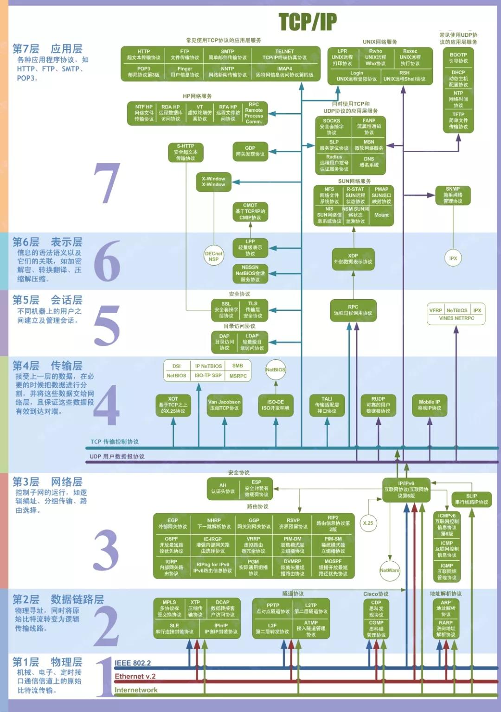

#### 在浏览器输入URL后发生的事
1. 解析URL，抽取出域名字段
2. DNS解析
- **查询浏览器缓存**（浏览器会缓存之前拿到的DNS 2-30分钟）如果没有 
- **检查系统缓存**， 检查hosts文件，这个文件保存了一些以前访问过的网站的域名和IP的数据
- **检查路由器缓存** ，路由器有自己的DNS缓存（**本地服务器缓存**）那里可能有相关的内容
- **递归查询**，从根域名服务器到顶级域名服务器再到极限域名服务器依次搜索对应的目标域名的IP
3. 找到对应的ip后就建立TCP连接（三次握手）
 

 4. 请求和传输数据
 5. 页面渲染
 **总结**：DNS->CDN->负载均衡->反向代理->http（get、post）->TCP四层数据流转（握手、关闭）->Servlet->MVC->缓存->持久化->页面渲染

 #### OSI七层模型
 应用层->表示层->会话层->传输层->网络层->数据链路层->物理层
 

 #### TCP/IP四层模型
 
 1. 应用层：负责处理特定的应用程序细节
 2. 运输层：主要为两台主机上的应用提过端到端的通信
 3. 网络层（互联网层）：处理分组在网络中的活动，比如分组的选路
 4. 链路层：包括操作系统中的设备驱动程序、计算机对应的网络接口卡

